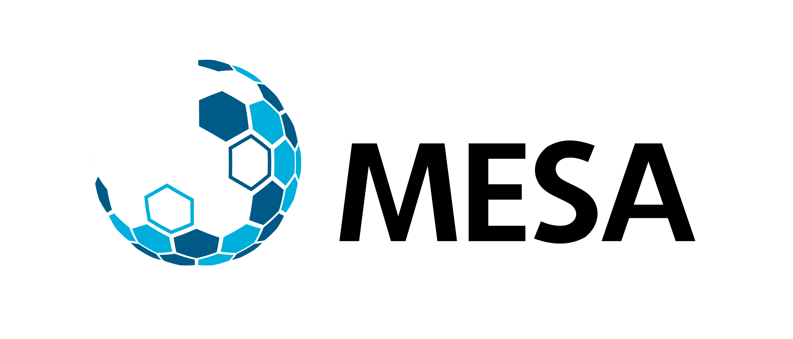

<!-- This site is under maintenance. -->

 Thank you for attending our workshop! This site is for accessing all the material for the workshop. To respect all the people who contributed to these presentations, we ask that you please do not distribute the content you can find here.

 More content will be available after the workshop starts.

<!-- We would appreciate if you could fill in this [feedback form](...) to let us know how to improve the workshop if we hold it again in future. -->

----
### Prof. Niels Kjaergaard: Engaging Academic Talks

* [Resources - Please read and prepare BEFORE the workshop](files/niels_final.pdf)

### Steve Ting: Effectively Communicating Research to the General Public

### Dr. Anna Garden: Creating and Presenting Academic Posters
 
----
#### Housekeeping

* [University of Otago Guest Wifi](files/otago_guestwifi.pdf)

----

